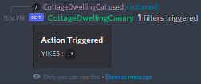

# Automod Filter
These [automod](Autmod.md) commands are specifically tailored to delete or flag messages containing everything from profanity 'Arch btw'.

## Automod Filter Add
{: .d-inline-block }
Slash Command
{: .label .label-green }
Modal
{: .label .label-pink }

```xml
/automod filter add <action> <regex>? <clean-message>? <remove-spaces>?
```

| arg           | type   | use                                                              |
|---------------|--------|------------------------------------------------------------------|
| action        | Action | What should happen when a message violates the filter            |
| regex         | bool   | Is the filter Regex based (``true``) or not (``false``, default) |
| clean-message | bool   | When true message formatting and alternate fonts are removed     |
| remove-spaces | bool   | When true spaces, newlines, and other whitespace are removed     |

This command adds a new automoderation filter, after the command is run an [Automod Input Modal](http://tryitands.ee/) is displayed to the user. When ``clean-message`` is ``true`` messages like "𝓘'𝓶 𝓪 \*\*𝓬𝓾𝓽𝓮\*\* 𝓬𝓪𝓽" will become "I'm a cute cat", enabling ``remove-spaces`` will make it harder for users to avoid your filter by sending messages like "a r c h   b t y", but may result in increased false positives. It is Recommended you instead mane a custom Regex filter and use that.

## Automod Filter Update
{: .d-inline-block }
Slash Command
{: .label .label-green }
Modal
{: .label .label-pink }

```xml
/automod filter add <filter> <action>? <regex>? <clean-message>? <remove-spaces>?
```

| arg           | type                                                | use                                                              |
|---------------|-----------------------------------------------------|------------------------------------------------------------------|
| filter        | [AutomodFilter](index.md#autocomplete-option-types) | Specifies what filter to update.                                 |
| action        | Action                                              | What should happen when a message violates the filter            |
| regex         | bool                                                | Is the filter Regex based (``true``) or not (``false``, default) |
| clean-message | bool                                                | When true message formatting and alternate fonts are removed     |
| remove-spaces | bool                                                | When true spaces, newlines, and other whitespace are removed     |

This command modifies an automoderation filter, after the command is run an [Automod Input Modal](http://tryitands.ee/) is displayed to the user. When ``clean-message`` is ``true`` messages like "𝓘'𝓶 𝓪 \*\*𝓬𝓾𝓽𝓮\*\* 𝓬𝓪𝓽" will become "I'm a cute cat", enabling ``remove-spaces`` will make it harder for users to avoid your filter by sending messages like "a r c h   b t y", but may result in increased false positives. It is Recommended you instead mane a custom Regex filter and use that.

## Automod Filter Test
{: .d-inline-block }
Slash Command
{: .label .label-green }
Modal
{: .label .label-pink }

```xml
/automod filter test
```

This command will test an automoderation filter, after you input a message in the modal you will get presented with a list of filters it violates.


## Automod Filter Remove
{: .d-inline-block }
Slash Command
{: .label .label-green }

```xml
/automod filter remove <filter>
```

| arg    | type                                                | use                              |
|--------|-----------------------------------------------------|----------------------------------|
| filter | [AutomodFilter](index.md#autocomplete-option-types) | Specifies what filter to delete. |

This command deletes an automoderation filter, this action cannot be undone.
