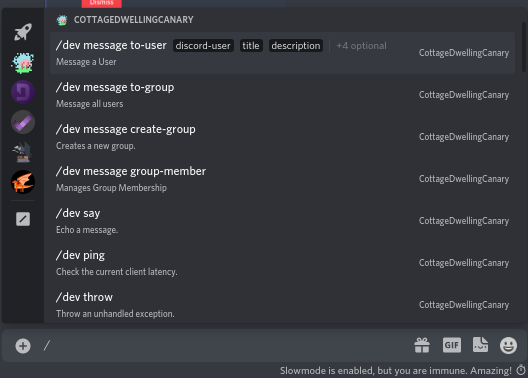
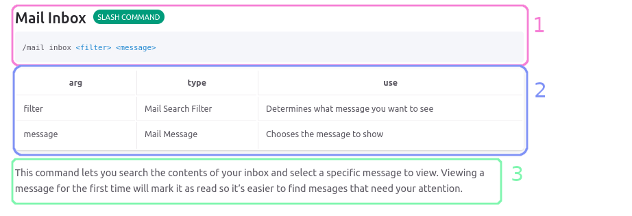
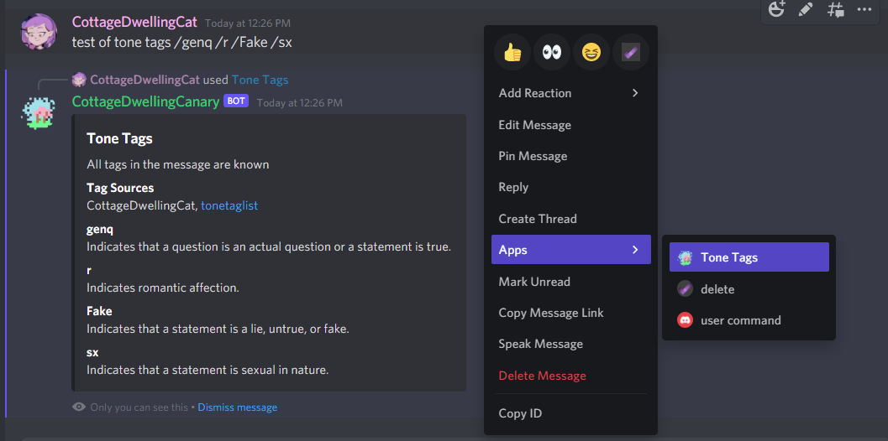

  

    Table of contents
  

  {: .text-delta }
- TOC
{:toc}

# Commands
CatCore (like most modern Discord bots) uses a set of tools called **application commands** to communicate with users. These tools make developing discord bots significantly faster, allow users to interact with bots more efficiently, and reduce the chance of invalid input. Although commands are super cool they can be hard to grasp, this document provides a starting point for interacting with interactions.

## Slash Commands
Slash Commands are commands regestered by an application and appear above the chat box when a user types '/'. They can get different types of input (like numbers, text, or users) and have required and non-required options. You can run a slash command by typing slash and spelling out it's name, then clicking each option and inputting the correct value.

### Documenting Slash Commands

1. Command Information, This includes the name of a command, what type it is (like slash or context menu), and the correct syntax to run it.
2. Argument List, This shows additional details about each option, like what type of input you need and what the option determines.
3. Additional Info, this gives details about what will happen when you run the command and common trouble shooting tips for errors.

### Autocomplete Option Types
Some command options may populate a list of responces from the bots database. These options are populated using a Discord feature called Autocomplete. When CatCore sends Autocomplete options they represent an internal type stored in it's database. Because that type of input is not supported by Discord directly you **must** select one of the autocomplete options for the command to work properly.

## Context Menu Commands
Context menu commands are displayed on the right click menu of users and messages in the Web and Desktop versions of Discord. In order to use a context menu command right click a message or user, select the apps sub-menu, and click a command. 

)
