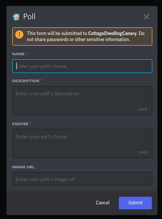

# Modals
Some slash commands may prompt you to fill out a custom menu called a modal. Commands that do that will have the Modal label.

## Creating and Updating Polls

| field | description | 
| name | The poll's name | 
| description | The poll's description |
| footer | The poll's footer |
| Image URL | A link to a ``.png`` Image, if the link is invalid or does not respond with an image it will be impossible to send the poll |

Creating and updating a poll will respond with a modal. If the ``Image URL`` field has a value that is not a url to a valid PNG your poll will fail to load.

